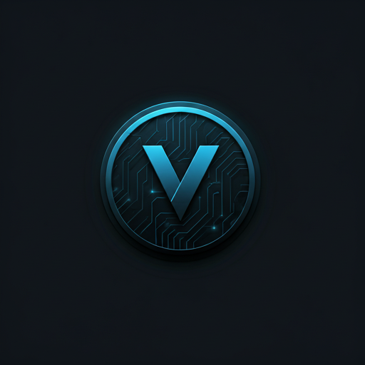

# Vault

## Overview

Vault is an advanced encryption standard algorithm based on AES-256, upgraded to utilize AES-512 with support for GCM. It incorporates custom keys by randomly generating two secure AES-256 keys and concatenating them together to form an even more secure encryption mechanism.

## Tech Stack

- **C++20**
- **Premake 5**
- **Visual Studio 2022 (Preferred)**
- **Visual Studio 2019 (Supported)**

## Prerequisites

To build and set up Vault, you need the following:

- **Premake 5**: Download from the official site [here](https://premake.github.io/download).
- **Updated C++ Compiler**: Visual Studio 2022 is preferred, but Visual Studio 2019 will work as well.

## Build and Setup

1. **Download and Install Premake 5**
    - Follow the instructions on the [official site](https://premake.github.io/download).

2. **Setup the Solution**
    - Navigate to the `Scripts/` folder.
    - Run the appropriate file for your operating system:
        - For Windows (x64): `Win-GenerateProject.bat`
        - For macOS and Linux: `GenerateProject.sh`

3. **Generate the Solution**
    - This will generate the `Vault.sln` file in the root directory where you can run the code directly.

## Running the Code

- Open the `Vault.sln` file in your preferred IDE (Visual Studio 2022 recommended).
- Build and run the project to start using Vault.

## Contributing

This project is for fun and is open source. You are welcome to contribute and add/push pull and merge requests. When I have time, I will most likely allow them or provide a reason if not accepted. Please just be mindful of development and, instead of doing this in the main or dev branch, create a new branch with fixes or something like `<branch_name>`.

Enjoy using Vault!

## License

This project is licensed under the terms of the MIT license. See the LICENSE file for details.

## Useful Links

- **Visual Studio 2022**: [Download](https://visualstudio.microsoft.com/downloads/)
- **Visual Studio 2019**: [Download](https://visualstudio.microsoft.com/vs/older-downloads/)
- **GCC (GNU Compiler Collection)**: [Download](https://gcc.gnu.org/)
- **Clang**: [Download](https://releases.llvm.org/download.html)
- **Visual Studio Code**: [Download](https://code.visualstudio.com/download)

